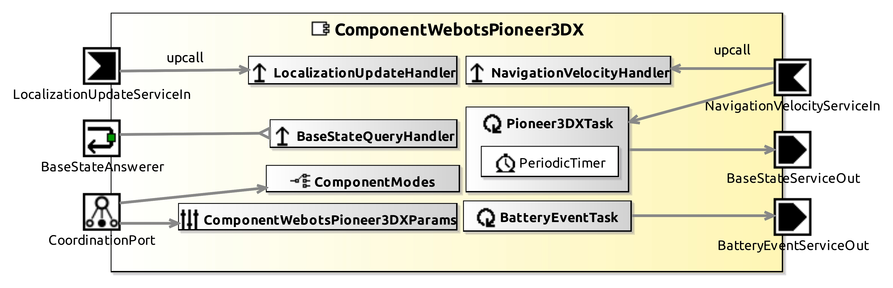
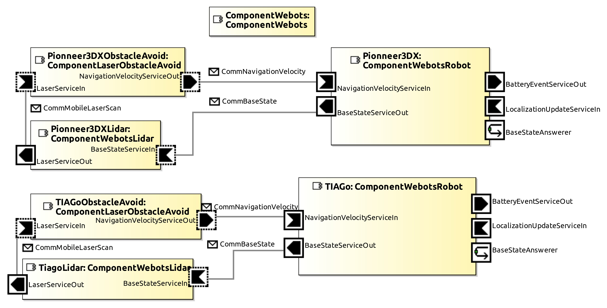
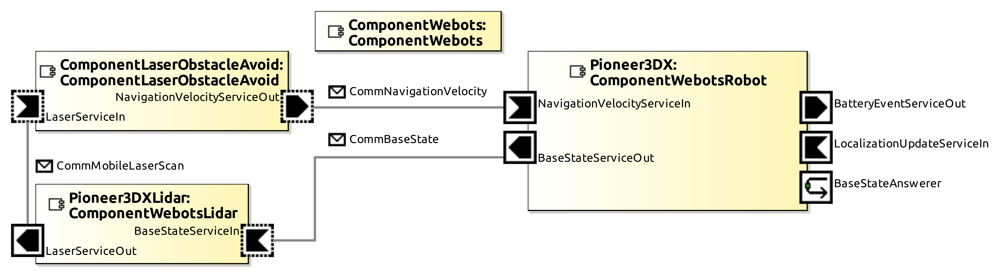
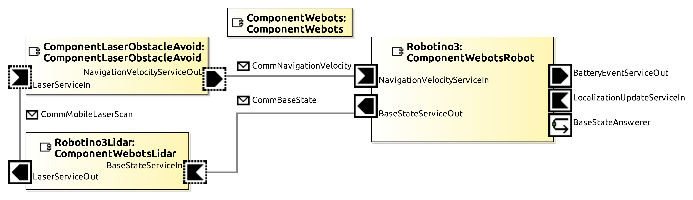
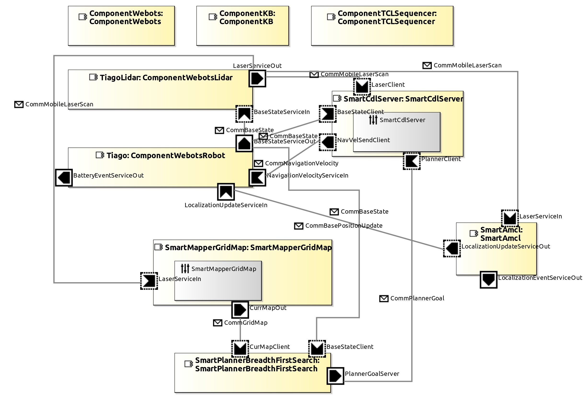

# AROSYS

[](https://travis-ci.com/cyberbotics/AROSYS)
[](https://app.gitguardian.com)
[](LICENSE)

## Components
The following components are new components for RobMoSys in order to be able to use them with the [Webots simulator](https://cyberbotics.com).

### ComponentWebots
This component allows the user to use Webots simulator instead of Gazebo, PlayerStage, etc. There exists a pre-requirement to use Webots. You have to execute this command once in a Terminal and restart the computer/Virtual Machine. Don't forget to adapt the path if necessary.
`echo -e "export WEBOTS_HOME=/home/smartsoft/SOFTWARE/webots" >> ~/.profile`


### ComponentWebotsBumper

This component configures bumper's sensors in SmartSoft according to Webots prototype sensors and provides the bumper value.
When used in a system, the name of the bumper should be defined in the `configuration.json` file in the `data` directory of the component.


| Input  | Output |
| ------ | ------ |
|   | **BumperEventServiceOut**: bumper value |


### ComponentWebotsLidar

This component configures lidar's sensors in SmartSoft according to Webots prototype sensors and provides the sensor's data.
When used in a system, the name of the lidar should be defined in the `configuration.json` file in the `data` directory of the component.


| Input  | Output |
| ------ | ------ |
| **BaseStateServiceIn**: state of the robot base (position and orientation) | **LaserServiceOut**: lidar values |

> **Note** : It is important to mentionned that the lidar range has to be under 65.535 meter otherwise it will be set at 65 meter because the variable type to store the value is `short`. This comes from source files generated by SmartMDSD. Maintainers will be alerted to this problem so that it can be improved.

### ComponentWebotsRobot
This component configures a robot in Smartsoft, it provides basic functionality for navigation and localization.
When used in a system, the name of the robot and its navigation properties should be defined in the `configuration.json` file in the `data` directory of the component.



| Inputs  | outputs |
| ------- | ------- |
| **LocalizationUpdateServiceIn**: not implemented yet | **BatteryEventServiceOut**: not implemented yet |
| **NavigationVelocityServiceIn**: velocity commands (linear velocities and turnrate) | **BaseStateServiceOut**: state of the robot base (position and orientation) |


#### JSON configuration
Each robot has his specification such as the wheel radius (R), wheel separation (L) and the velocity coefficients. For two wheeled robot, these latter are calculated using simple formulas such as `V_right = w(R+L/2)` and `V_left = w(R-L/2)` which gives `coeff_0 (for Vx) = 1/R`, `coeff_1 (for Vy) = 0` and `coeff_2 (for Omega) = L/(2R)`.  For omniwheeled robot such as the Robotino 3, a matrix conversion can be found in [this paper](http://ftp.itam.mx/pub/alfredo/ROBOCUP/SSLDocs/PapersTDPs/omnidrive.pdf) at section 4. 

* **Pioneer 3-DX**

  For the [Pioneer 3-DX](https://cyberbotics.com/doc/guide/pioneer-3dx) from Adept, when using `ComponentWebotsRobot` in   SmartMDSD Toolchain, you have to configure the `configuration.json` file with this code:
  ```
  {
    "name": "Pioneer 3-DX",
    "navigationVelocity": {
      "right wheel": [10.2564, 0.0, 1.3795],
      "left wheel": [10.2564, 0.0, -1.3795]
    }
  }
  ```

* **TIAGo**

  For the TIAGo robots series from Pal Robotics, when using `ComponentWebotsRobot` in SmartMDSD Toolchain, you have to configure the `configuration.json` file with this code (adapt the name):
  ```
  {
    "name": "TIAGo Base/Iron/Steel/Titanium",
    "navigationVelocity": {
      "wheel_right_joint": [5.115, 0.0, 1.033],
      "wheel_left_joint": [5.115, 0.0, -1.033]
    }
  }
  ```

* **Robotino 3**

  For the [Robotino 3](https://cyberbotics.com/doc/guide/robotino3) from Festo, when using `ComponentWebotsRobot` in SmartMDSD Toolchain, you have to configure the `configuration.json` file with this code:
  ```
  {
    "name": "Robotino 3",
    "navigationVelocity": {
      "wheel0_joint": [13.856, -8, -2.944],
      "wheel1_joint": [-13.856, -8, -2.944],
      "wheel2_joint": [0.0, 16.0, -2.944]
    }
  }
  ```


---

## Systems
The following systems are examples to be able to test new components.

### SystemLaserObstacleAvoidTiagoWebotsSimulator
This system is a copy of the `SystemLaserObstacleAvoidTiagoGazeboSimulator` in order to show that the new components developed to use Webots simulator are working since the robot has the same behavior as expected.


A [TIAGo Iron](https://cyberbotics.com/doc/guide/tiago-iron) is used with a lidar that seems to be a [Sick TIM150-3010300](https://www.sick.com/ca/en/detection-and-ranging-solutions/2d-lidar-sensors/tim1xx/tim150-3010300/p/p595144?ff_data=JmZmX2lkPXA1OTUxNDQmZmZfbWFzdGVySWQ9cDU5NTE0NCZmZl90aXRsZT1UaU0xNTAtMzAxMDMwMCZmZl9xdWVyeT0mZmZfcG9zPTImZmZfb3JpZ1Bvcz0yJmZmX3BhZ2U9MSZmZl9wYWdlU2l6ZT0yNCZmZl9vcmlnUGFnZVNpemU9MjQmZmZfc2ltaT05MS4w) with a range of 10 meters and an aperture angle of 200 degree.

### SystemLaserObstacleAvoidP3dxWebotsSimulator
This system is a copy of the `SystemLaserObstacleAvoidP3dxPlayerStageSimulator` in order to show that the new components developed to use Webots simulator are working since the robot has the same behavior as expected.


A [Pioneer 3-DX](https://cyberbotics.com/doc/guide/pioneer-3dx) is used with a lidar that seems to be a [Sick TIM150-3010300](https://www.sick.com/ca/en/detection-and-ranging-solutions/2d-lidar-sensors/tim1xx/tim150-3010300/p/p595144?ff_data=JmZmX2lkPXA1OTUxNDQmZmZfbWFzdGVySWQ9cDU5NTE0NCZmZl90aXRsZT1UaU0xNTAtMzAxMDMwMCZmZl9xdWVyeT0mZmZfcG9zPTImZmZfb3JpZ1Bvcz0yJmZmX3BhZ2U9MSZmZl9wYWdlU2l6ZT0yNCZmZl9vcmlnUGFnZVNpemU9MjQmZmZfc2ltaT05MS4w) with a range of 10 meters and an aperture angle of 180 degree.

### SystemWebotsMultiRobots
This system shows an example of multi-robots simulation. All the robots are using a [lidar sensor](https://cyberbotics.com/doc/guide/lidar-sensors) (`ComponentWebotsLidar`) to perfom obstacle avoidance.



### SystemWebotsPioneer3DXNavigation
This system shows a complete example of communication between a [lidar sensor](https://cyberbotics.com/doc/guide/lidar-sensors) (`ComponentWebotsLidar`) used by a [Pioneer 3-DX](https://cyberbotics.com/doc/guide/pioneer-3dx) robot (`ComponentWebotsRobot`) to navigate in a square arena filled with obstacles. It works with the new components developed to use Webots.



### SystemWebotsRobotino3Navigation
This system shows a complete example of communication between a [lidar sensor](https://cyberbotics.com/doc/guide/lidar-sensors) (`ComponentWebotsLidar`) used by a [Robotino 3](https://cyberbotics.com/doc/guide/robotino3) robot (`ComponentWebotsRobot`) to navigate in a square arena filled with obstacles. It works with the new components developed to use Webots.



### SystemWebotsTiagoNavigation
This system is a copy of the `SystemTiagoNavigation` in order to show that the new components developed to use Webots simulator are working since the robot has the same behavior as expected.


